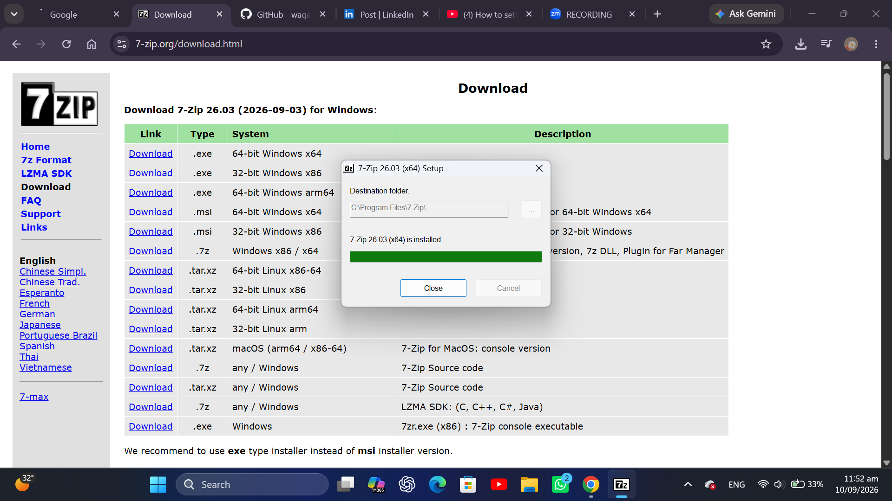
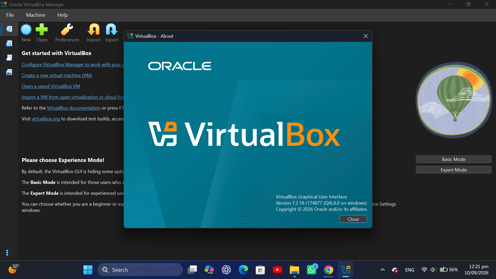
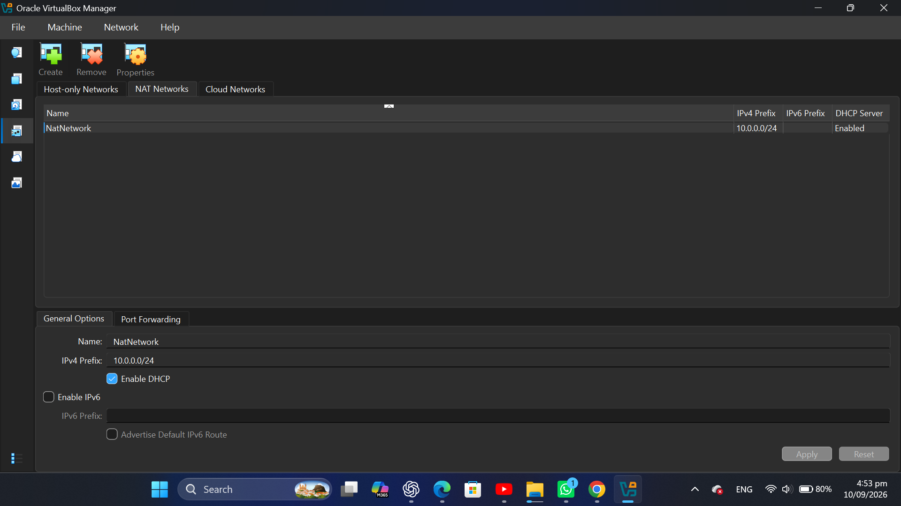
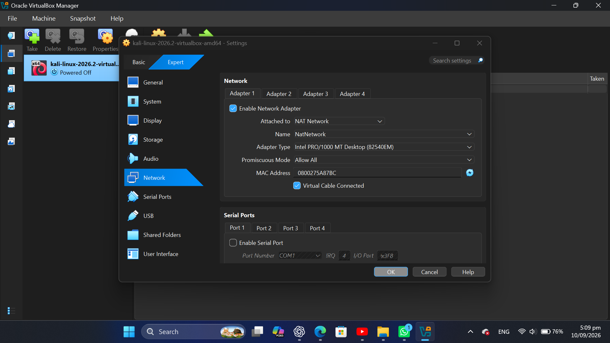
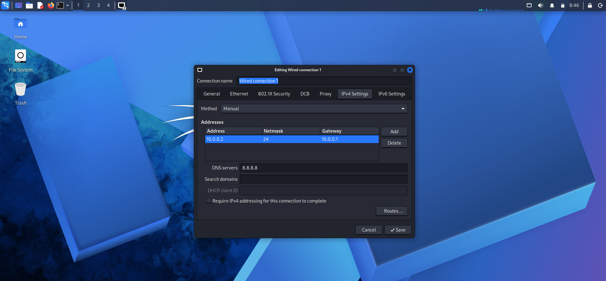
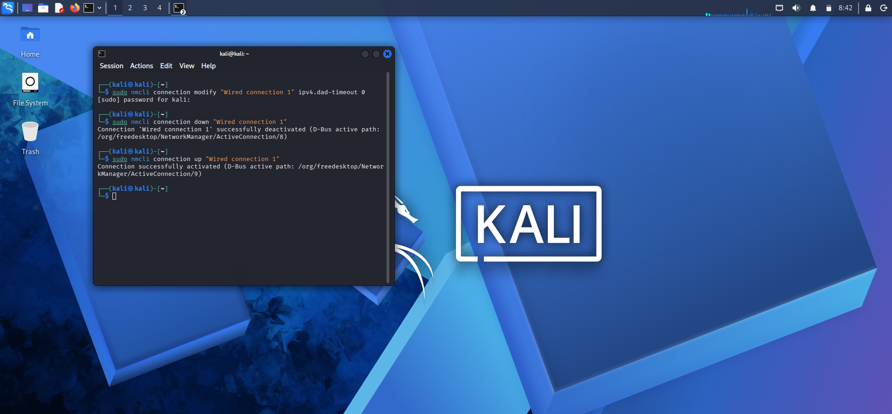
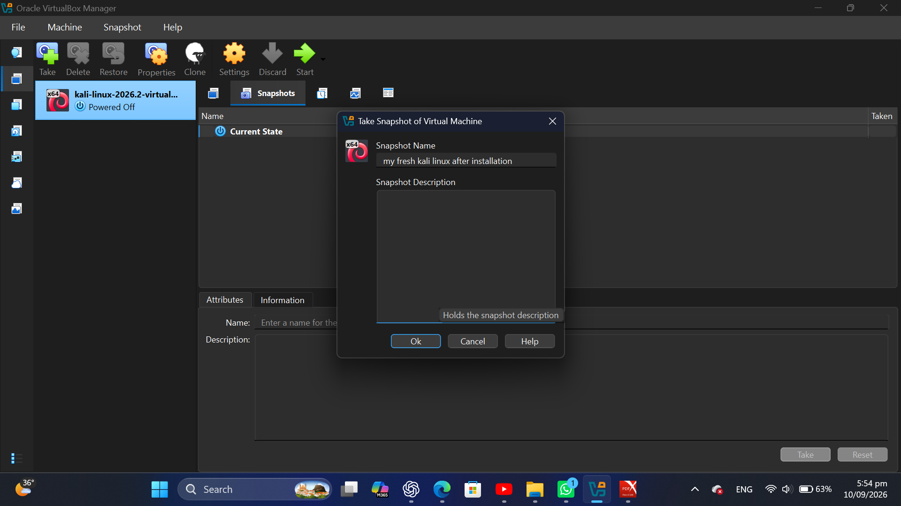

# 🛡️ Week 1: Cybersecurity Lab Environment Setup

## 📌 Project Overview
As part of my internship at **NetworkWalks Academy**, I designed and deployed a secure, isolated virtual laboratory for cybersecurity and ethical hacking practice. This environment allows for safe network scanning, vulnerability assessment, and penetration testing without risking the host machine.

## 🎯 Objectives
- Install and configure Oracle VirtualBox (latest version) as the base hypervisor
- Deploy Kali Linux as the primary attacking/security testing machine
- Configure a custom `NATNetwork` in the `10.0.0.0/24` subnet
- Enable host-guest integration (Bidirectional Shared Clipboard and Drag'n'Drop)
- Configure a Shared Folder mapping the host's `/Downloads` directory to the VM
- Assign a static IP address (`10.0.0.2/24`) to the Kali VM
- Ensure full internet access and verify connectivity
- Capture a clean baseline snapshot of the VM

## ⚙️ Lab Configuration
|  Component | ⚙️ Configuration |
| --- | --- |
| ️ Host OS | Windows 11 |
| 🧰 Hypervisor | VirtualBox 7.2.8 |
| 🐉 Security OS | Kali Linux 2026.2 |
| 🧠 Kali RAM | 2048 MB (2 GB) |
| 🌐 Virtual Network | NATNetwork |
| 📡 Network Range | 10.0.0.0/24 |
| 🐧 Kali IP Address | 10.0.0.2/24 |
| 🚪 Default Gateway | 10.0.0.1 |
|  DNS Server | 8.8.8.8 |
| 📁 Shared Folder | Host `Downloads` mapped to VM |

---

##  Setup Procedure (Phase 1)

### Step 1: Install 7-Zip
Installed **7-Zip** to handle compressed virtual machine archives.

> 📸 
> *Figure 1: 7-Zip installation completed.*

### Step 2: Install VirtualBox
Installed the latest version of **Oracle VirtualBox** as the hypervisor.

> 📸 
> *Figure 2: VirtualBox version 7.2.16 installed.*

### Step 3: Create NAT Network
Created a custom `NATNetwork` to ensure all future lab machines can communicate with each other while maintaining internet access.

**Configuration:**
- **Network Name:** NatNetwork
- **IPv4 Prefix:** 10.0.0.0/24
- **DHCP:** Enabled
- **IPv6:** Disabled

> 📸 
> *Figure 3: Custom NATNetwork configured with 10.0.0.0/24 subnet.*

### Step 4: Import Kali Linux & Configure Network
Downloaded the official Kali Linux VirtualBox image and configured the network adapter:

- **Network Adapter:** Attached to `NATNetwork`
- **Adapter Type:** Intel PRO/1000 MT Desktop

> 📸 
> *Figure 4: Kali Linux VM network adapter attached to NATNetwork.*

### Step 5: Configure VM Integration Settings
Enabled host-guest integration features for better workflow:

- **Shared Clipboard:** Bidirectional
- **Drag and Drop:** Bidirectional
- **Shared Folders:** Auto-mounted host's `Downloads` folder

### Step 6: Configure Kali Linux Static IP
Configured the Kali Linux machine to use a static IP address for consistent network referencing.

**Network Configuration:**
- **IP Address:** 10.0.0.2
- **Subnet Mask:** 255.255.255.0 (/24)
- **Gateway:** 10.0.0.1
- **DNS:** 8.8.8.8

> 📸 
> *Figure 5: Static IP 10.0.0.2/24 configured in Kali Linux.*

### Step 7: Fix Internet Connectivity (VirtualBox v7 Issue)
Applied the known fix for VirtualBox v7 with Kali Linux 2026.1+ IPv4 Duplicate Address Detection (DAD) timeout issue.

**Commands Executed:**
bash
sudo nmcli connection modify "Wired connection 1" ipv4.dad-timeout 0
sudo nmcli connection down "Wired connection 1"
sudo nmcli connection up "Wired connection 1"

> 📸 
> *Figure 6: NetworkManager commands executed to fix internet connectivity.*

### Step 8: Create Baseline Snapshot
Created a VirtualBox snapshot to preserve the clean baseline configuration.

> 📸 
> *Figure 7: Clean baseline snapshot created for recovery purposes.*

---

## 🔎 Lab Verification

| ✅ Test | 🧾 Command | 🎯 Expected Result |
| --- | --- | --- |
| Check IP Assignment | `ip a` | Shows 10.0.0.2/24 |
| Test Local Gateway | `ping 10.0.0.1` | Successful replies |
| Test Internet Access | `ping 8.8.8.8` | Successful replies |
| Test DNS Resolution | `nslookup networkwalks.com` | Domain resolves correctly |

---

## 🔧 Troubleshooting

### Issue: No Internet Connectivity in Kali VM
**Context:** This is a known issue in VirtualBox v7 with Kali Linux 2026.1+ due to IPv4 Duplicate Address Detection (DAD) timeouts.

**Solution Applied:**
```bash
sudo nmcli connection modify "Wired connection 1" ipv4.dad-timeout 0
sudo nmcli connection down "Wired connection 1"
sudo nmcli connection up "Wired connection 1"

---

**Internship Project:** NetworkWalks Academy  
**Week:** 1 - Project Module 1  
**Author:** [Aiman Atif]  
**Date:** [12-09-2026]
